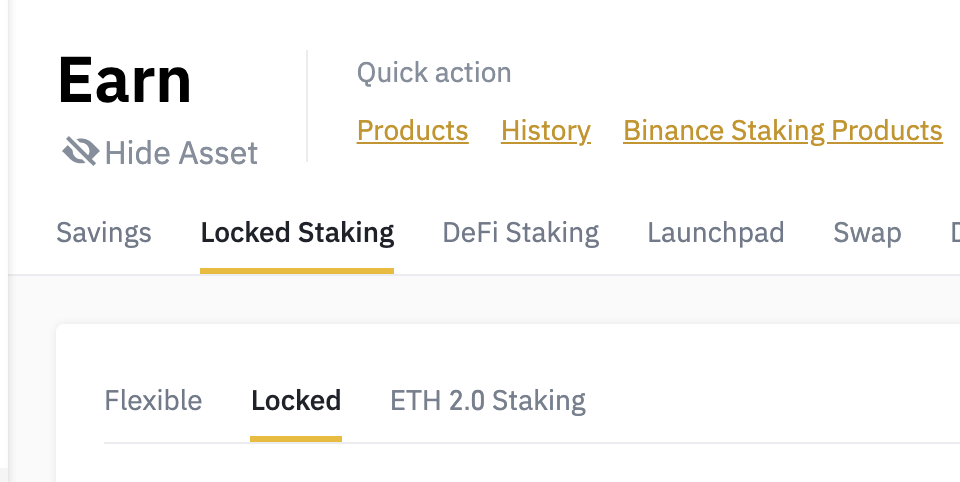
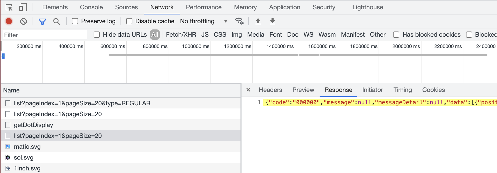

# binance-staking-to-csv

Minimal CLI to convert the Binance locked staking JSON (returned by their private API) to a CSV that can be imported into portfolio trackers like CoinStats.

## How to use

```
npm install -g binance-staking-to-csv
```

Then navigate to https://www.binance.com/en/my/wallet/account/saving

Click on "Locked Staking"



Open the dev tools, click on 'locked staking', and check the XHR call that loads the json data




Run `binance-staking-to-csv` in your CLI and paste the JSON content. It'll generate a `out.csv` for you!


## License

MIT
